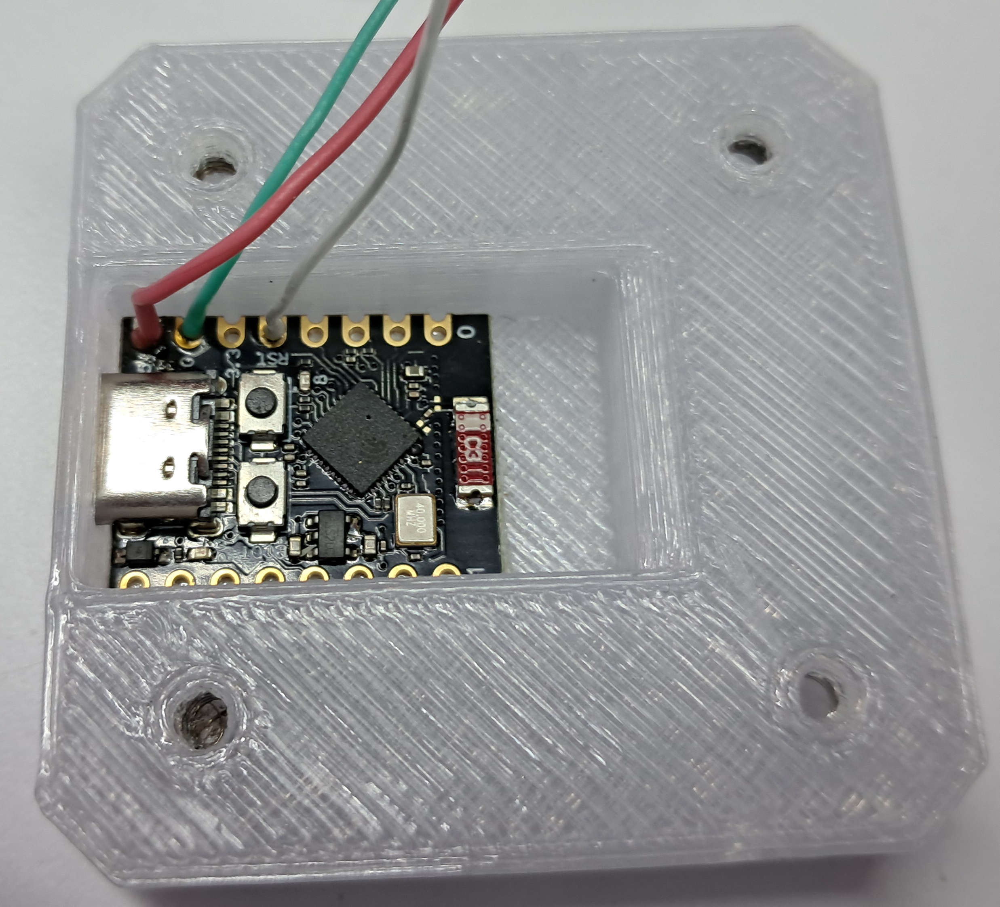

# MQTT Traffic light

## Opening the project in Clion

In order to open the project you have to install PlatformIO core (simply `run $sudo python3 mqtt_traffic_light/Firmware/get-platformio.py`, then install the PlatformIO Clion plugin. If you have any troubles, check official PlatformIO documentation (https://docs.platformio.org/en/latest/core/installation/index.html).
After you have successfully installed PlatformIO core and PlatformIO plugin in CLion, go to Clion tools menu->PlatformIO->PlatformIO Home, go to the PlatformIO Home web page -> Open project -> select mqtt_traffic_light/Firmware -> open -> close the file manager. After that you can open the project in Clion as usual. To build and flash the firmware, simply use the run button in Clion (make sure you have your ESP32C3 connected with a USB-C cable, if it does not work, try pressing the "boot" button before plugging in the cable)

## Project structure

The firmware is built on Arduino framework, so in the main.cpp there are setup() and loop(). There are two classes: TrafficLight and MqttController. In the TrafficLight all the basic logic of state and config is implemented. In the MqttController all the mqtt logic is implemented. 

## Traffic light logic
Traffic light has four possible configurations: MAIN_3_STATE, MAIN_PLUS_RIGHT, MAIN_PLUS_LEFT, MAIN_PLUS_BOTH. As follows from the naming it has either 3 main lights, 1 or 2 side arrows. The main lights can be set to red, yellow and green, while the arrows can be set to off or green. The control is implemented with Adafruit NeoPixel library for WS2812B led strip.

## MQTT logic 
When traffic light is booted, it connects to the Wifi then connects to MQTT broker. As soon as it is connected to the broker it publishes a message to the init topic and collects responses with IDs of active traffic lights during specified timeframe. After that it picks an ID=n+1, where n is the greatest id it collected, that is later published to the same topic. After the traffic light selected it's ID, it subscribes to it's control topic and starts usual operation loop (monitors init topic and announces it's id on request, monitors control topic and responds to requests of changing the configuration or the state.) 
The wifi SSID, password, mqtt address and port, mqtt init topic and mqtt control topic base, as well as the timeframe of recieving id announce responds is specified in the `mqtt_traffic_light/Firmware/src/Config.h` file. 
If you want to use mqtt credentials for connection, simply uncomment corresponding lines in the Config.h file and put your credentials in there, TLS certificate auth is not yet supported.

## Controlling individual traffic lights
To change the config of a specific traffic light, you have to publish a message to the corresponding mqtt control topic:
`SET_CONFIG MAIN_3_STATE` / `SET_CONFIG MAIN_PLUS_RIGHT` /  `SET_CONFIG MAIN_PLUS_LEFT` / `SET_CONFIG MAIN_PLUS_BOTH`

To change the state of a specific traffic light, you have to publish a message to the corresponding mqtt control topic: 
`SET MAIN RED`/`YELLOW`/`GREEN LEFT OFF`/`GREEN RIGHT OFF`/`GREEN`
e.g. `SET MAIN RED LEFT OFF  RIGHT GREEN`

If the state does not match the config, parts not present in the config (e.g. one or both arrows) will simply not be applied, but the others will be. So if you notice, that setting the arrow state does not apply, check the traffic light configuration.

## Assembly
### First you need to get the required hardware:

1. ~82mm (5 LEDs) of WS2812B LED strip 60LED/M
2. ~0.5 meter of thin wire
3. ~130-150mm 3-wire XH2.54 male cable
4. 3-pin XH2.54 female connector
5. 4 M3x10 screws
6. 4 M3 nuts
7. ESP32C3 supermini 
8. 3d-printed parts from mqtt_traffic_light/Mesh_models (i used PETG with 0.6mm nozzle, all parts, except for trafficlight_head_case_p1 are printed without supports). Make sure to set a pause, when printing base.stl, to put the screws inside before the gaps are covered. 
9. Hot glue 
10.  Soldering tools
11. Super glue 
12. A little bit of Double-sided tape
13. A little bit of regular tape

### Assembly steps:
1. Glue the **XH2.54 female connector** into the **base_lid** part, so it is flush with the bottom side of it. 
2. Solder the  **XH2.54 female connector** to the 5V, GND, GPIO4 pins of the **ESP32C3**. 
3. Use double-sided tape to fix the **ESP32C3** in the **base** part, so the USB-C port is inside the corresponding slot and is easily accessible from the outside.

4. Screw the **base_lid** to the **base** part.
5. Asseble the core of the traffic light head using the **traffic_light_head_bare** part, WS2812B, thin wire and the **3-wire XH2.54 male cable**. Make sure the pinout of all the **WS2812B** strips matches the pinout of the **ESP32C3** with the **XH2.54 female connector**.

6. Cover the holes for the lights of the **traffic_light_head_case_p1** with regular tape, and pour hot glue in the holes. The hot glue shoul be flush with both sides of the part. Wait for the hot glue to cool down.
7. Insert the core of the traffic light head into the **traffic_light_head_case_p1** part. It does not matter if it is not alligned perfectly, it is also not supposed to be flush with the back side of the **traffic_light_head_case_p1**.
8. Insert the **traffic_light_head_case_p2** into the **traffic_light_head_case_p1**, if it is not fixed by friction, use some super glue. 
9. Connect the **3-wire XH2.54 male cable** to the **XH2.54 female connector**. Put the Traffic light head fixture onto the **base_lid**. 
10.  Power on the Traffic light and check if it works correctly (use UART monitor for logs and send a state command to the corresponding topic to check the LEDS. If the LEDS do not turn on, but the logs are ok and you have sent the change state command, probably you have faulty wiring.).

11.* The **traffic_light_head_bare**, **traffic_light_head_case_p1** and **traffic_light_head_case_p2** are supposed to be selected based on the traffic light configuration you want to use: e.g. for MAIN_PLUS_BOTH use parts with "both" at the end. The wiring should be changed accordingly: For single arrow configs, the arrow data input is connected directly to the main strip output and for both arrows, the right one is connected first, and the left one is connected to the right one.

## Congratulations, now you can build your own small-scale traffic light system with as many different traffic lights as you want.
